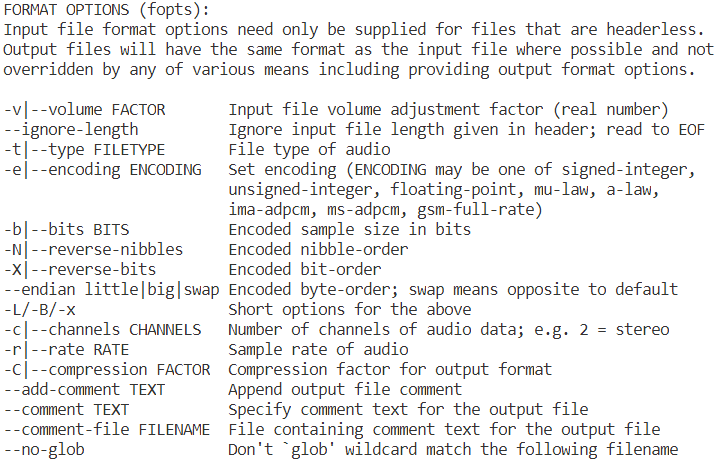
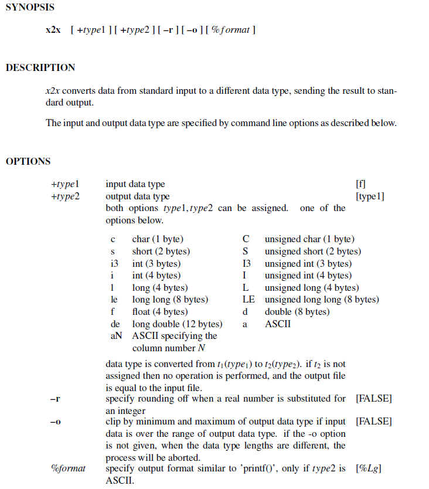
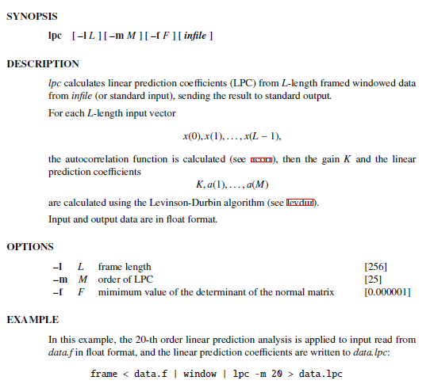
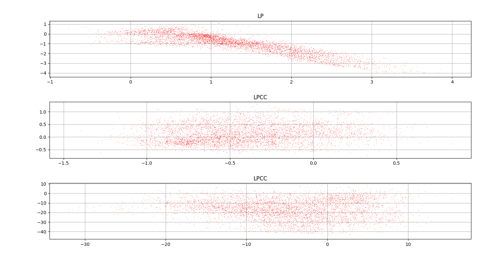
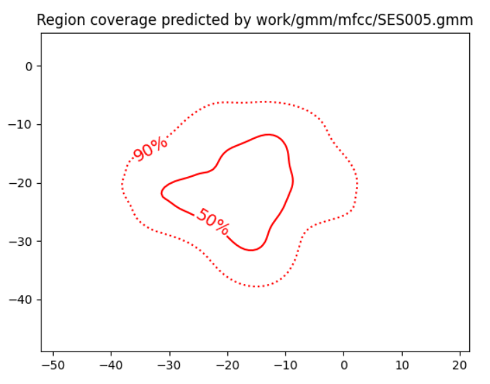
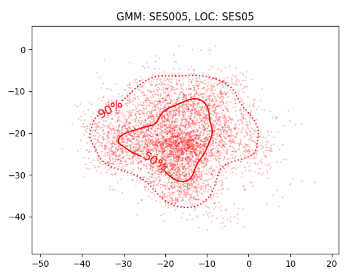
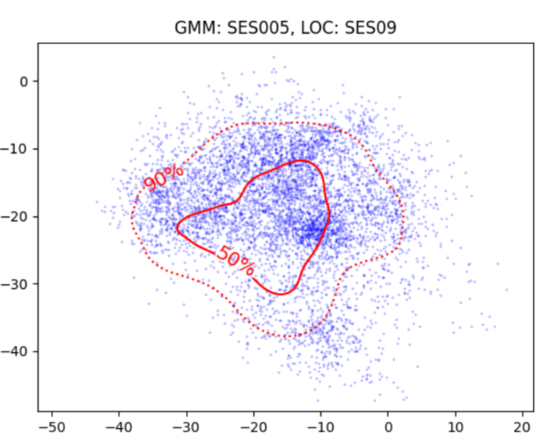
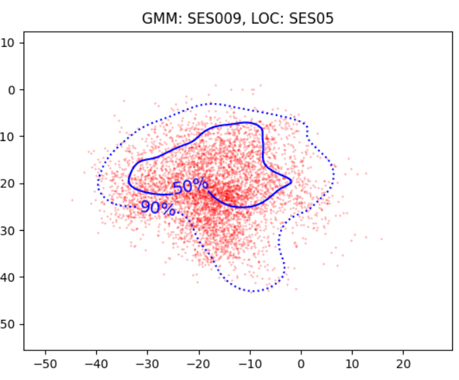
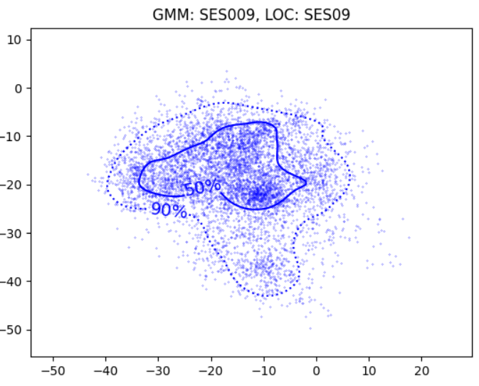

PAV - P4: reconocimiento y verificación del locutor
===================================================

Obtenga su copia del repositorio de la práctica accediendo a [Práctica 4](https://github.com/albino-pav/P4)
y pulsando sobre el botón `Fork` situado en la esquina superior derecha. A continuación, siga las
instrucciones de la [Práctica 2](https://github.com/albino-pav/P2) para crear una rama con el apellido de
los integrantes del grupo de prácticas, dar de alta al resto de integrantes como colaboradores del proyecto
y crear la copias locales del repositorio.

También debe descomprimir, en el directorio `PAV/P4`, el fichero [db_8mu.tgz](https://atenea.upc.edu/pluginfile.php/3145524/mod_assign/introattachment/0/spk_8mu.tgz?forcedownload=1)
con la base de datos oral que se utilizará en la parte experimental de la práctica.

Como entrega deberá realizar un *pull request* con el contenido de su copia del repositorio. Recuerde
que los ficheros entregados deberán estar en condiciones de ser ejecutados con sólo ejecutar:

~~~~~~~~~~~~~~~~~~~~~~~~~~~~~~~~~~~~~~~~~~~~~~~~~~~~~.sh
  make release
  run_spkid mfcc train test classerr verify verifyerr
~~~~~~~~~~~~~~~~~~~~~~~~~~~~~~~~~~~~~~~~~~~~~~~~~~~~~

Recuerde que, además de los trabajos indicados en esta parte básica, también deberá realizar un proyecto
de ampliación, del cual deberá subir una memoria explicativa a Atenea y los ficheros correspondientes al
repositorio de la práctica.

A modo de memoria de la parte básica, complete, en este mismo documento y usando el formato *markdown*, los
ejercicios indicados.

## Ejercicios.

### SPTK, Sox y los scripts de extracción de características.

- Analice el script `wav2lp.sh` y explique la misión de los distintos comandos involucrados en el *pipeline*
  principal (`sox`, `$X2X`, `$FRAME`, `$WINDOW` y `$LPC`). Explique el significado de cada una de las 
  opciones empleadas y de sus valores.

  _**SoX**, Sound eXchange, the Swiss Army knife of audio manipulation, permite realizar multitud de tareas con ficheros de audio:_
    * Conversión de formatos de señal y de fichero.
    * Reproducción de audio en múltiples sistemas.
    * Distintas operaciones de procesado de señal.
    * Distintos efectos de audio.

  _Las opciones que hemos usado son las de la salida que son las siguientes:_

  + **-t:** Nos permite indicar el tipo de formato, en nuestro caso *raw*
  + **-e** Nos permite indicar el tipo de codificación, en nuestro caso *unsigned-integer*
  + **-b** Nos permite indicar el número de bits

  _El programa se ejecuta des del shell y para ver sus opciones más relevante, lo ejecutamos mediante el comando *sox -h*._

  

  _A continuación vemos como se ha aplicado *SoX*, donde se usa para convertir de la ley mu a entero de dos bytes con signo_

  ```cpp
  sox spk_8mu/speecon/BLOCK01/SES014/SA014S24.wav -t raw -e signed -b 16 fichero
  ```
  
  _**$X2X**, es el programa de SPTK que permite la conversión entre distintos formatos de datos._

  _Las opciones que hemos usado son las siguientes:_
  + **+type1** Le podemos indicar el tipo de entrada que tenemos, en nuestro caso hemos usado **+s (2 bytes)**.
  + **+type2** Nos permite indicar el tipo de salida que queremos obtener, en nuestro caso **+f (4 bytes)**.

  

  _A continuación vemos como aplicamos el comando x2x para convertir los enteros de dos bytes a reales de cuatro bytes,
  en nuestro caso convertir de short a float para obtener reales de coma flotante de 4 bytes:_

  ```cpp
  sox spk_8mu/speecon/BLOCK01/SES014/SA014S24.wav -t raw -e signed -b 16 fichero - | sptk x2x +s +f > fichero
  ```
  _**$FRAME**, Toma la señal en la entrada y devuelve a su salida la misma señal dividida en tramas de **l** muestras tomdas con un desplazamiento de **p** muestras_

  _Las opciones que hemos usado son las siguientes:_
    + **-l** Nos permite dividir la señal de entrada en tramas, en nuestro caso de 240 muestras
    + **-p** Nos permite realizar un desplazamiento de la ventana, en nuestro caso con un desplazamiento de 80 muestras.

  

  _**$WINDOW**, nos permite multiplicar cada trama por una ventana(opción por defecto es la ventana Blackman)_

  _Las opciones que hemos usado son las siguientes:_

   + **-l** nos indica como esta organizado los datos en la entrada (tamaño de entrada de la trama)
   + **-L** nos indica como lo queremos en la salida (tamaño de salida de la trama)

  


  _**$LPC**, (Linear prediction coefficients), permite calcular los coeficientes de predicción lineal, 
  es decir, calcula los lpc_order primeros coeficientes de predición lineal_

  _Las opciones que hemos usado son las siguientes:_

   + **-l** indica el tamaño de la trama
   + **-m** indica el order de LPC

  

- Explique el procedimiento seguido para obtener un fichero de formato *fmatrix* a partir de los ficheros de
  salida de SPTK (líneas 45 a 47 del script `wav2lp.sh`).

    ```sh
  # Our array files need a header with the number of cols and rows:
  ncol=$((lpc_order+1)) # lpc p =>  (gain a1 a2 ... ap) 
  nrow=$($X2X +fa < $base.lp | wc -l | perl -ne 'print $_/'$ncol', "\n";')
  ```
  _En el fichero fmatrix se encuentra almacenada la información mediante el número de filas y de columnas, seguido por los datos._

  _El número de columnas **(ncol)** es igual al número de coeficientes que conlleva calcularlo des del orden del predictor_
  _lineal más uno, ya que en el primer elemento del vector se almacena la ganancia de predicción._

  _En el número de filas **(nrow)** es igual al número de tramas, debido a que depende de la longitud se la señal,_ 
  _la longitud y desplazamiento de la ventana, y la cadena de comandos que se ejecutan para obtener la parametrización._ 
  _Por todo lo nombrado anteriormente, es mejor, extraer esa información del fichero obtenido._

  _Por lo tanto, lo hacemos convirtiendo la señal parametrizada a texto, usando sox +fa, y contando el número de líneas,_ 
  _con el comando de UNIX wc -l._

  * ¿Por qué es conveniente usar este formato (u otro parecido)? Tenga en cuenta cuál es el formato de
    entrada y cuál es el de resultado.

    _Porque nos permite ver a la salida los datos que tiene el fichero con la información de cuántas tramas y de cuántos coeficientes tenemos, en la cual queda visualizada en una matriz en forma ordenada  donde cada fila nos indica el número de tramas entre corchetes y en cada columna el valor que le corresponde a cada una de las tramas._

- Escriba el *pipeline* principal usado para calcular los coeficientes cepstrales de predicción lineal
  (LPCC) en su fichero <code>scripts/wav2lpcc.sh</code>:

  ```sh
  # Main command for feature extration
  sox $inputfile -t raw -e signed -b 16 - | $X2X +sf | $FRAME -l 240 -p 80 | $WINDOW -l 240 -L 240 |
	$LPC -l 240 -m $lpc_order | $LPCC -m $lpc_order -M $lpcc_order > $base.lpcc

  # Our array files need a header with the number of cols and rows:
  ncol=$((lpcc_order+1))
  nrow=`$X2X +fa < $base.lpcc | wc -l | perl -ne 'print $_/'$ncol', "\n";'`
  ```

- Escriba el *pipeline* principal usado para calcular los coeficientes cepstrales en escala Mel (MFCC) en su
  fichero <code>scripts/wav2mfcc.sh</code>: 

  ```sh
  # Main command for feature extration
  sox $inputfile -t raw -e signed -b 16 - | $X2X +sf | $FRAME -l 240 -p 80 | $WINDOW -l 240 -L 240 |
  $MFCC -l 240 -m $mfcc_order -s 8 -n 40 -w 1 > $base.mfcc 

  # Our array files need a header with the number of cols and rows:
  ncol=$((mfcc_order)) 
  nrow=$($X2X +fa < $base.mfcc | wc -l | perl -ne 'print $_/'$ncol', "\n";')
  ```

### Extracción de características.

- Inserte una imagen mostrando la dependencia entre los coeficientes 2 y 3 de las tres parametrizaciones
  para todas las señales de un locutor.
    ### En la última gráfica tiene que decir MFCC
    
     
  + Indique **todas** las órdenes necesarias para obtener las gráficas a partir de las señales 
    parametrizadas.

    _En primera instancia hemos procedido ha guardar los coeficientes 2 y 3 de la parametrización **LP, LPCC y MFCC**_ 
    _con las siguientes órdenes:_

      + _Parametrización LP_
        ```
          fmatrix_show work/lp/BLOCK01/SES017/*.lp | egrep '^\[' | cut -f4,5 > lp_2_3.txt
        ```
      + _Parametrización LPCC_
        ```
          fmatrix_show work/lpcc/BLOCK01/SES017/*.lpcc | egrep '^\[' | cut -f4,5 > lpcc_2_3.txt
        ```
      + _Parametrización MFCC_
        ```
          fmatrix_show work/mfcc/BLOCK01/SES017/*.mfcc | egrep '^\[' | cut -f4,5 > mfcc_2_3.txt
        ```
    _Después de convertir a texto los ficheros de parámetros de cada parametrización, hemos representado los valores_
    _usando Python:_ 

      ```py
        import matplotlib.pyplot as plt
        import numpy as np

        lp_2_3 = np.loadtxt('python/lp_2_3.txt')
        lpcc_2_3 = np.loadtxt('python/lpcc_2_3.txt')
        mfcc_2_3 = np.loadtxt('python/mfcc_2_3.txt')

        plt.figure()

        plt.subplot(311)
        plt.plot(lp_2_3[:,0], lp_2_3[:,1],'r,')
        plt.title('LP')
        plt.grid()

        plt.subplot(312)
        plt.plot(lpcc_2_3[:,0], lpcc_2_3[:,1],'r,')
        plt.title('LPCC')
        plt.grid()

        plt.subplot(313)
        plt.plot(mfcc_2_3[:,0], mfcc_2_3[:,1],'r,')
        plt.title('LPCC')
        plt.grid()

        plt.subplots_adjust(top=0.92, bottom=0.08, left=0.10, right=0.95, hspace=0.45,
                            wspace=0.35)

        plt.show()
      ```

  + ¿Cuál de ellas le parece que contiene más información?
    
    _Cuando se refiere que sistema de extracción  de características contiene más información, quiere decir,_ 
    _cual es el mejor método que nos proporcione los coeficientes más incorrelados, ya que de esa forma habrá menos redundancia._

    _Por lo tanto, con el objetivo de saber qué método contiene mejor información, se ha procedido a graficarlas:_

    + LP: _Observamos que los coeficientes presentan una distribución prácticamente lineal, por lo cual nos aporta poca información._

    + LPCC: _Vemos que en los coeficientes  tiene una distribución dispersa, es decir, que coeficientes son incorrelados_
      _y obtendremos una elevada información._

    + MFCC: _A primera instancia a diferencia de los dos métodos anteriores vemos que los coeficientes son más incorrelados._ 
    
    _En conclusión, el método de extracción  que nos aporta más información es el MFCC._

- Usando el programa <code>pearson</code>, obtenga los coeficientes de correlación normalizada entre los
  parámetros 2 y 3 para un locutor, y rellene la tabla siguiente con los valores obtenidos.

  |                        |     LP    |   LPCC   |    MFCC    |
  |------------------------|:---------:|:--------:|:----------:|
  | &rho;<sub>x</sub>[2,3] | -0.872284 | 0.150782 | -0.0812356 |
  
  + Compare los resultados de <code>pearson</code> con los obtenidos gráficamente.

  _Observamos que los resultados son los esperados. Por una parte, vemos en el LP que en los coeficientes 2 y 3, aporta poca información; en el caso del LPCC aporta un poco más de información pero el MFCC sin duda es el que aporta más información_
  
- Según la teoría, ¿qué parámetros considera adecuados para el cálculo de los coeficientes LPCC y MFCC?
  
  _Según la teoría visualizada en clase consideramos que un orden de 30 coeficientes para el MFCC es suficiente, además con el orden del filtro en 40. Son valores al límite de los recomendados, más sería sobredimensional el sistema con menos no obtenemos mejores resultados. Sobre los coeficientes de LPCC usamos los valores recomendados por la librería SPTK, que nos dan un excelente resultado, siendo 25 el orden del LP y 25 el del LPCC._

### Entrenamiento y visualización de los GMM.

Complete el código necesario para entrenar modelos GMM.

- Inserte una gráfica que muestre la función de densidad de probabilidad modelada por el GMM de un locutor
  para sus dos primeros coeficientes de MFCC.

  _Para la visualización del modelo del locutor SES005, se ha ejecutado:_

  ```
  gmm_train -d work/mfcc -e mfcc -g SES005.gmm lists/class/SES005.train 

  plot_gmm_feat work/gmm/mfcc/SES005.gmm
  ```
  _Podemos observar en gráfica como se muestran las regiones, por una parte una curva punteada exterior que encierra la región con el 90% de las tramas y con curva continua interna que encierra la región con el 50% de las tramas_



  
- Inserte una gráfica que permita comparar los modelos y poblaciones de dos locutores distintos (la gŕafica
  de la página 20 del enunciado puede servirle de referencia del resultado deseado). Analice la capacidad
  del modelado GMM para diferenciar las señales de uno y otro.

  ```
  plot_gmm_feat work/gmm/mfcc/SES005.gmm work/mfcc/BLOCK00/SES005/*
  ```
   
  
  
  

  _Como podemos observar en la gráfica las regiones con el 90% y 50% de la masa de probabilidad_
  _para los GMM de los locutores SES005(en rojo, arriba) y SES009(en azul, abajo); también se muestra_
  _la población del usuario SES005(en rojo, izquierda) y SES009(en azul, derecha)._

  _Por lo tanto, vemos que no hay una mayor  densidad en el centro, ya que no hay coincidencia entre las regiones y la población pero en la zona que hay una mayor densidad es en la parte central inferior, donde nos permitirá saber que señal pertenece a uno o otro locutor_ 


### Reconocimiento del locutor.

Complete el código necesario para realizar reconociminto del locutor y optimice sus parámetros.

- Inserte una tabla con la tasa de error obtenida en el reconocimiento de los locutores de la base de datos
  SPEECON usando su mejor sistema de reconocimiento para los parámetros LP, LPCC y MFCC.

  |               |   LP   | LPCC  | MFCC  |
  |---------------|:------:|:-----:|:-----:|
  | Tasa de Error | 11.46% | 0.51% | 3.44% |

### Verificación del locutor.

Complete el código necesario para realizar verificación del locutor y optimice sus parámetros.

- Inserte una tabla con el *score* obtenido con su mejor sistema de verificación del locutor en la tarea
  de verificación de SPEECON. La tabla debe incluir el umbral óptimo, el número de falsas alarmas y de
  pérdidas, y el score obtenido usando la parametrización que mejor resultado le hubiera dado en la tarea
  de reconocimiento.

  ### FALTA: incluir el umbral óptimo, el número de falsas alarmas y de  pérdidas

  |                |  LP  | LPCC | MFCC |
  |----------------|:----:|:----:|:----:|
  | Cost Detection | 79.2 | 11.6 | 32.4 |
 
### Test final

- Adjunte, en el repositorio de la práctica, los ficheros `class_test.log` y `verif_test.log` 
  correspondientes a la evaluación *ciega* final.

  _Adjuntado_ [**class_test.log**](https://github.com/josepbf/P4/blob/josep-ingrid/class_test.log)
  _y_ [**verif_test.log**](https://github.com/josepbf/P4/blob/josep-ingrid/verif_test.log)

### Trabajo de ampliación.

- Recuerde enviar a Atenea un fichero en formato zip o tgz con la memoria (en formato PDF) con el trabajo 
  realizado como ampliación, así como los ficheros `class_ampl.log` y/o `verif_ampl.log`, obtenidos como 
  resultado del mismo.
